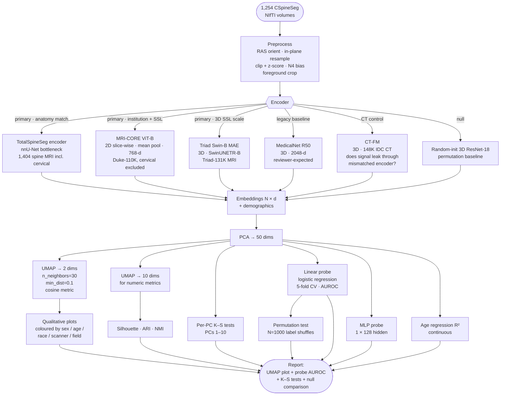

# Pipeline Sketch

End-to-end flow for the demographic-probing diagnostic. See
`methodology.md` for the *why* behind each stage; this document is the
*what* and *in what order*.

---

## Flow diagram



---

## Minimum viable first experiment

A day of work. The question is "is demographic signal visibly encoded?" —
a scatter plot answers that. If clusters are obvious, the plot *is* the
result; no p-value needed.

1. **Preprocess** — RAS orient, z-score per volume. Skip N4 and cropping
   for now.
2. **Extract** — MRI-CORE ViT-B frozen features on the mid-sagittal slice
   per volume, 768-d. Lowest-friction path: Apache-2.0 weights, ready
   feature-extraction API, Duke-institution alignment. (MedicalNet is
   the alternative if you want the reviewer-baseline number first, but
   requires stripping the segmentation head yourself.)
3. **Reduce** — PCA to 2 dims.
4. **Plot** — scatter coloured by sex / age bin / race.

Done. If clusters are visible, show it at the next meeting and decide
what's worth investing more rigour in.

### When to add more

- **No visible clusters in PCA(2)** — could be no signal, non-linear
  structure (PCA is linear), or signal in PCs 3+. Then try UMAP, or a
  linear probe AUROC on the top PCs.
- **"Could this just be FOV / intensity?"** — add the random-init 3D
  ResNet-18 null, and compare. Re-run with foreground cropping.
- **"Is this just Duke scanner fingerprints?"** — add Triad-SwinB
  (non-Duke MRI pretraining) and MedicalNet. If MRI-CORE leaks more
  than the non-Duke encoders, institutional fingerprint is confounding
  the demographic probe.
- **"Does anatomy match matter?"** — add TotalSpineSeg (only public
  encoder trained on cervical sagittal T2). Compare to MRI-CORE / Triad.
- **Writing it up** — full methodology.md treatment: permutation test,
  per-PC K–S, MLP probe, multiple encoders, age-regression R².

---

## Output structure

Proposed location under the existing EDA report convention:

```
outputs/probe/
├── {encoder}/{timestamp}/
│   ├── embeddings.parquet        # series_submitter_id + demographics + 50-d PCA
│   ├── umap_2d.parquet           # 2-D UMAP coords
│   ├── umap_by_sex.png
│   ├── umap_by_age.png
│   ├── umap_by_race.png
│   ├── umap_by_scanner.png
│   ├── umap_by_field_strength.png
│   ├── probe_linear.csv          # attribute → AUROC ± 95% CI
│   ├── probe_mlp.csv
│   ├── ks_per_pc.csv             # PC × attribute-pair → p-value
│   └── stats.json                # everything above, machine-readable
└── _comparison/                  # cross-encoder summary
    ├── probe_auroc_vs_encoder.png
    └── probe_summary.csv
```

Fits alongside `outputs/eda/` and uses the same `EDAReport` pattern if
convenient, with one additional concept (encoder variant).

---

## Dependencies to add

Probably:

```
uv add umap-learn pacmap  # manifold learning
uv add SimpleITK          # N4 bias correction
uv add torch torchvision  # already present
```

Encoder weight sources — cache under `/work3/s225224/models/<encoder>/`:

- **MRI-CORE** (`mazurowski-lab/mri_foundation`) — `MRI_CORE_vitb.pth`
  via the repo README's Google Drive link. Apache-2.0.
- **TotalSpineSeg** (`neuropoly/totalspineseg`) — nnU-Net checkpoints via
  the releases page; strip the decoder head before feature extraction.
- **Triad Swin-B (MAE)** (`wangshansong1/Triad`) — Google Drive; pick
  the SwinUNETR-B MAE variant.
- **MedicalNet** (`Tencent/MedicalNet`) — `resnet_50_23dataset.pth` from
  the release page or HF `TencentMedicalNet/MedicalNet-Resnet50`. Strip
  `conv_seg` head.
- **CT-FM** — pip-installable from AIM Harvard project page.
- **RadImageNet** (`BMEII-AI/RadImageNet`) — pretrained weights are
  public via Google Drive (only the *dataset* is access-gated).
