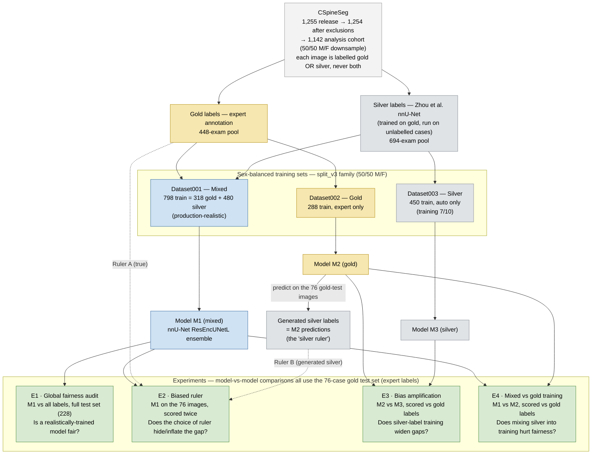
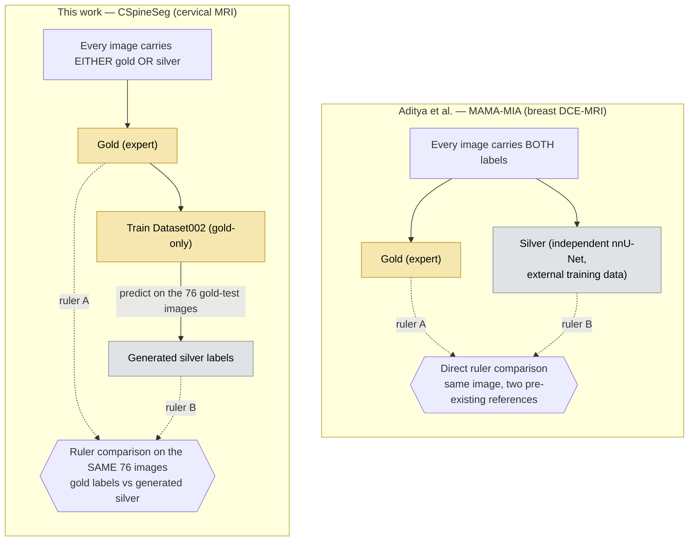

# 06 — Gold / Silver Label Experiment

> **Status (2026-06-05):**
> - **Gold (Dataset002): fully evaluated + biased ruler done.** All 10 folds trained. Ensemble
>   selected (CV macro Dice 0.8831). Predictions on 76 gold test images: VB 0.914, Disc 0.862,
>   Macro 0.888. Biased ruler experiment (Run 6) complete: silver ruler narrows apparent race/sex
>   gaps by 70–86%; all DIRs remain above 0.80 on both rulers.
>   *Provenance note:* `2d` fold 1 crashed at epoch 959 (transient `OSError: Stale file handle`)
>   and was finished via a resume/validation step — it had converged (poly-LR ≈ 0, EMA Dice
>   plateaued ~0.89), so no effect on results.
> - **Silver (Dataset003): 7/10 trained.** `2d` complete (5/5). `3d_fullres`: folds 2–3 done;
>   fold 0 has `checkpoint_final` but needs a validation-only pass (`--val`); fold 1 training in
>   progress (job 28602550, ~44 h); fold 4 had no checkpoint and needs a fresh retrain. Folds 0
>   and 4 are submitted via `jobs/finish_silver.sh`. `find_best_configuration` for Dataset003 is
>   blocked until folds 0/1/4 finish.
>
> Both 3d_fullres retrains use `nnUNet_n_proc_DA=1` to avoid the recurring glibc/DA-worker crash
> ("background workers are no longer alive") that killed the original fold-1 and fold-4 runs.

## Pipeline at a Glance

How the three datasets are built, how each label set is produced, and which models feed
which experiment. All model-vs-model comparisons are scored on the **same 76-case gold test
set** (`split_v3_gold`, expert labels) so that differences are attributable to training
labels — not to the test data.



### How each label set is produced

| Label set | Provenance | Used as |
|---|---|---|
| **Gold** | Expert manual annotation (original CSpineSeg) | Training labels for Dataset002; ground-truth reference (Ruler A) for E2–E4 |
| **Silver (original)** | Zhou et al. trained an nnU-Net on the gold development set and ran it on the unannotated cases | Training labels for Dataset003 and the silver portion of Dataset001 |
| **Generated silver** | **M2 (our gold-trained model) predicting on the 76 gold-test images** | The "silver ruler" (Ruler B) for the biased-ruler experiment E2 only |

The *generated silver* labels mirror how the *original* silver labels were created — a
gold-trained nnU-Net applied to images it never saw in training — but produced on our own
split so the 76 test cases are guaranteed unseen.

### How this differs from the MAMA-MIA "biased ruler"

Our biased-ruler setup adapts Aditya et al.'s MAMA-MIA design to a dataset where gold and
silver labels never co-exist on the same image.



- **MAMA-MIA:** each image already has both an expert (gold) and an automated (silver)
  reference, so the two rulers can be compared directly on every image.
- **CSpineSeg:** each image has only one label tier. We therefore *generate* the second
  ruler by predicting with the gold-trained M2 on the 76 gold-test images. Both rulers then
  exist for the same images, and any difference in the observed fairness gap is the pure
  ruler effect.
- **Why not reuse Zhou et al.'s silver model?** Its weights are unavailable, and its training
  split may overlap our gold test cases — a leakage risk. M2 is trained on our split, which
  excludes the test cases by design.

## Three Models, Three Roles

| Dataset | Train cases | Labels | Split file | Role | Status |
|---|---|---|---|---|---|
| `Dataset001_CSpineSeg` | 798 (318 gold + 480 silver) | Mixed | `split_v3` | **Global fairness audit** | Trained |
| `Dataset002_CSpineSeg_Gold` | 288 | Expert (gold) | `split_v3_gold` | **Bias amplification baseline** + **biased ruler** (predictions on gold test images serve as generated silver labels) | **Evaluated ✅** |
| `Dataset003_CSpineSeg_Silver` | 450 | Auto-generated (silver) | `split_v3_silver` | **Bias amplification** — compare against gold-trained | **Training (7/10)** — 3d_fullres f0/f1/f4 pending |

All three use sex-balanced cohorts (50/50 M/F in every split).

### Dataset001 — Global fairness audit

Dataset001 is the "production-realistic" model: trained on all available labels without
distinguishing quality. This is what someone would actually deploy. It is evaluated on
the full test set (228 cases) against all labels, and compared to the published baseline
(Zhou et al.). The main fairness analysis — demographic performance gaps across race,
age, sex — uses this model. See `05_model_selection.md`.

### Dataset002 — Biased ruler experiment

In MAMA-MIA, every image had both a gold and a silver label, so the ruler comparison was
direct: the silver labels came from an independent nnU-Net trained on external data.
CSpineSeg images have either gold or silver — not both.

The adapted approach: use Dataset002 (gold-trained) to generate predictions on the gold
test images. Those predictions serve as the "generated silver labels." This mirrors how the
original silver labels were created (Zhou et al. trained an nnU-Net on the gold development
set and applied it to unannotated cases). We cannot use their original model because (a)
the weights are not available, and (b) their training set uses a different split, so some of
our gold test cases may have been in their training data — a leakage risk. Dataset002 avoids
this since it is trained on our own split, which excludes the test cases by design.

We then evaluate Dataset001 (the mixed model) against both rulers on the same 76 gold test
images:

- Evaluate Dataset001 against **gold labels** → true performance
- Evaluate Dataset001 against **Dataset002's predictions** (generated silver) → observed performance

Any difference in the fairness gap between the two evaluations is the pure ruler effect:
same model, same images, different reference labels. Crucially, Dataset001 and Dataset002
are independently trained models, so Dice ≠ 1.

> **Note:** Evaluating Dataset001 against its own predictions would give Dice = 1.0 for every
> case — that approach is degenerate and was rejected.

### Dataset002 — Bias amplification baseline

Dataset002 is trained on gold (expert) labels only. It has two roles:

1. **Bias amplification baseline** — compare its fairness gaps against Dataset003
   (silver-trained) on the same gold test set. If silver-trained has wider gaps, silver
   labels amplify bias through training.
2. **Silver label generator** for the biased ruler experiment (see above).

### Dataset003 — Bias amplification

Dataset003 is trained on silver (auto-generated) labels only. It is compared against
Dataset002 on the **same gold test set** (76 cases) to isolate whether silver training
labels widen demographic performance gaps (cf. Parikh et al. MAMA-MIA Experiment 4:
66% fairness gap widening, DIR dropping below 0.80).

## Evaluation Design

| Experiment | Model | Eval reference | What it shows |
|---|---|---|---|
| Global fairness audit | Dataset001 (mixed) | All test labels (228) | How fair is a realistically-trained model? |
| Biased ruler | Dataset001 (mixed) | Gold labels vs Dataset002's predictions (generated silver) on gold test images (76) | Does the choice of ruler inflate/deflate the observed fairness gap? |
| Bias amplification | Dataset002 (gold) vs Dataset003 (silver) | Gold test labels (76) | Does training on silver labels widen demographic gaps? |
| Mixed vs gold training | Dataset001 (mixed) vs Dataset002 (gold) | Gold test labels (76) | Does including silver labels in training hurt fairness? |

The gold test set (76 cases from `split_v3_gold`) is the apples-to-apples reference for
all pairwise model comparisons — same test cases, same expert ground truth, different
training labels. For the biased ruler experiment, Dataset002's predictions on these same
76 images serve as the generated silver labels (since CSpineSeg images have either gold
or silver labels, not both — unlike MAMA-MIA).

---

## Step 1 — Prepare Dataset (done 2026-05-07)

`src/nnunet/__init__.py` has a `DATASETS` registry mapping dataset ID to name and split
version. Both `prepare_dataset.py` and `write_splits.py` accept `--dataset-id`:

```bash
# Gold dataset
uv run -m src.nnunet.prepare_dataset --dataset-id 2

# Silver dataset
uv run -m src.nnunet.prepare_dataset --dataset-id 3
```

This creates:
```
$nnUNet_raw/
├── Dataset002_CSpineSeg_Gold/
│   ├── imagesTr/   (288 train + 44 val cases, symlinked)
│   ├── labelsTr/   (expert labels only)
│   ├── imagesTs/   (76 test cases)
│   └── dataset.json
└── Dataset003_CSpineSeg_Silver/
    ├── imagesTr/   (450 train + 66 val cases, symlinked)
    ├── labelsTr/   (auto-generated labels only)
    ├── imagesTs/   (138 test cases)
    └── dataset.json
```

---

## Step 2 — Plan and Preprocess (done)

CPU only (~10–20 min each). Run on login node:

```bash
uv run --env-file .env nnUNetv2_plan_and_preprocess -d 2 --verify_dataset_integrity
uv run --env-file .env nnUNetv2_plan_and_preprocess -d 3 --verify_dataset_integrity
```

---

## Step 3 — Write CV Splits (done)

Same stratified 5-fold logic as `write_splits.py`, split version is derived from `--dataset-id`:

```bash
uv run -m src.nnunet.write_splits --dataset-id 2
uv run -m src.nnunet.write_splits --dataset-id 3
```

Writes `splits_final.json` to each preprocessed dataset directory.

---

## Step 4 — Submit Training Jobs (done)

Same `jobs/train.sh` template, just different dataset IDs. Train both 2d and 3d_fullres
for consistency with Dataset001 — decide on best config per dataset after training via
`find_best_configuration`:

```bash
# Dataset002 — Gold (10 jobs, smaller dataset so faster)
for FOLD in 0 1 2 3 4; do
  sed "s/TPLCONFIG/2d/g;        s/TPLFOLD/${FOLD}/g" jobs/train.sh \
    | sed 's/DATASET_ID=1/DATASET_ID=2/' | bsub
  sed "s/TPLCONFIG/3d_fullres/g; s/TPLFOLD/${FOLD}/g" jobs/train.sh \
    | sed 's/DATASET_ID=1/DATASET_ID=2/' | bsub
done

# Dataset003 — Silver
for FOLD in 0 1 2 3 4; do
  sed "s/TPLCONFIG/2d/g;        s/TPLFOLD/${FOLD}/g" jobs/train.sh \
    | sed 's/DATASET_ID=1/DATASET_ID=3/' | bsub
  sed "s/TPLCONFIG/3d_fullres/g; s/TPLFOLD/${FOLD}/g" jobs/train.sh \
    | sed 's/DATASET_ID=1/DATASET_ID=3/' | bsub
done
```

Or add a `--dataset-id` parameter to `train.sh` and create a `submit_gold_silver.sh`.

---

## Step 5 — Predict, Ensemble, Postprocess (done 2026-06-05)

Predictions run on interactive GPU node (`a100sh`), both configs in parallel. Ensemble and
postprocessing run on login node.

```bash
# GPU: interactive node (two sessions in parallel)
uv run nnUNetv2_predict -d Dataset002_CSpineSeg_Gold \
    -i "${nnUNet_raw}/Dataset002_CSpineSeg_Gold/imagesTs" \
    -o "${nnUNet_results}/Dataset002_CSpineSeg_Gold/predictions_test_2d" \
    -f 0 1 2 3 4 -tr nnUNetTrainerWandB -c 2d -p nnUNetResEncUNetLPlans --save_probabilities

uv run nnUNetv2_predict -d Dataset002_CSpineSeg_Gold \
    -i "${nnUNet_raw}/Dataset002_CSpineSeg_Gold/imagesTs" \
    -o "${nnUNet_results}/Dataset002_CSpineSeg_Gold/predictions_test_3d_fullres" \
    -f 0 1 2 3 4 -tr nnUNetTrainerWandB -c 3d_fullres -p nnUNetResEncUNetLPlans --save_probabilities

# CPU (after predict jobs finish): find_best_config → ensemble → postprocess
bash jobs/ensemble_and_postprocess.sh 2
```

`find_best_configuration` result: ensemble (2d + 3d_fullres) wins (CV macro Dice 0.8831 vs
0.8819 for 2d alone). No postprocessing applied (keep-largest destroys multi-vertebra
structures, same as Dataset001).

Output: `$nnUNet_results/Dataset002_CSpineSeg_Gold/predictions_test_pp/` (76 files)

## Step 6 — Evaluate

### Dataset002 on gold test set (done 2026-06-05)

`labelsTs/` symlinks created for all 76 gold test cases pointing to expert segmentations.

```bash
source .env
uv run --env-file .env -m src.fairness.evaluate \
    --predictions "${nnUNet_results}/Dataset002_CSpineSeg_Gold/predictions_test_pp" \
    --references  "${nnUNet_raw}/Dataset002_CSpineSeg_Gold/labelsTs" \
    --mapping     "${nnUNet_raw}/Dataset002_CSpineSeg_Gold/case_id_mapping.json" \
    --output      "${nnUNet_results}/Dataset002_CSpineSeg_Gold/predictions_test_pp/eval_gold.csv" \
    --metrics dice hd95 ndsc
```

Results (76 gold test cases, expert labels):

| Model | VB Dice | Disc Dice | Macro Dice |
|---|---|---|---|
| Dataset002 (gold-trained) | 0.9141 | 0.8623 | 0.8882 |
| Dataset001 (mixed-trained, from `05_model_selection.md`) | 0.9216 | 0.8721 | 0.8969 |

Dataset001 scores marginally higher than Dataset002 on the gold test set despite being trained
on noisier labels — likely because it has ~2.8× more training cases (798 vs 288). This is a
preliminary result for the mixed vs gold comparison; the fairness gap comparison (DPD, DIR)
is what matters for the experiment conclusions.

### Biased ruler (done 2026-06-05 — Run 6 in `fairness-runs.md`)

Recomputed Ruler A (Dataset001 vs gold labels) and Ruler B (Dataset001 vs Dataset002 predictions)
on the same 76 gold test images with `dice hd95 ndsc`. CSVs written to
`Dataset001_CSpineSeg/predictions_test_pp/eval_ruler_gold.csv` and `eval_ruler_silver.csv`.
Fairness analysis in `outputs/fairness/biased_ruler/20260605_121654/`.

Key result: the generated silver ruler narrows apparent race and sex gaps by 70–86% (negative
DIR widening). All DIRs remain above 0.80 on both rulers. See `fairness-runs.md` Run 6 for full
numbers.

### Bias amplification (blocked until Dataset003 training completes)

1. Predict with Dataset003 on the gold test set (76 cases).
2. Evaluate against gold labels. Compare fairness gaps against Dataset002.

---

## Design Notes

- **Why 288 gold vs 450 silver train cases?** Structural property of CSpineSeg — fewer cases were expert-annotated. Acknowledged as a limitation; not a choice. The sex-balance (50/50) and race/age stratification are held constant.
- **Same config for all three models** — use whatever `find_best_configuration` selects for Dataset001 for consistency (ensemble 2d + 3d_fullres). This keeps the architecture constant so differences are attributable to training labels, not model capacity.
- **Gold test set is the reference** — all three models are evaluated against the same 76 gold test cases with expert labels. This isolates the effect of training labels on fairness.
