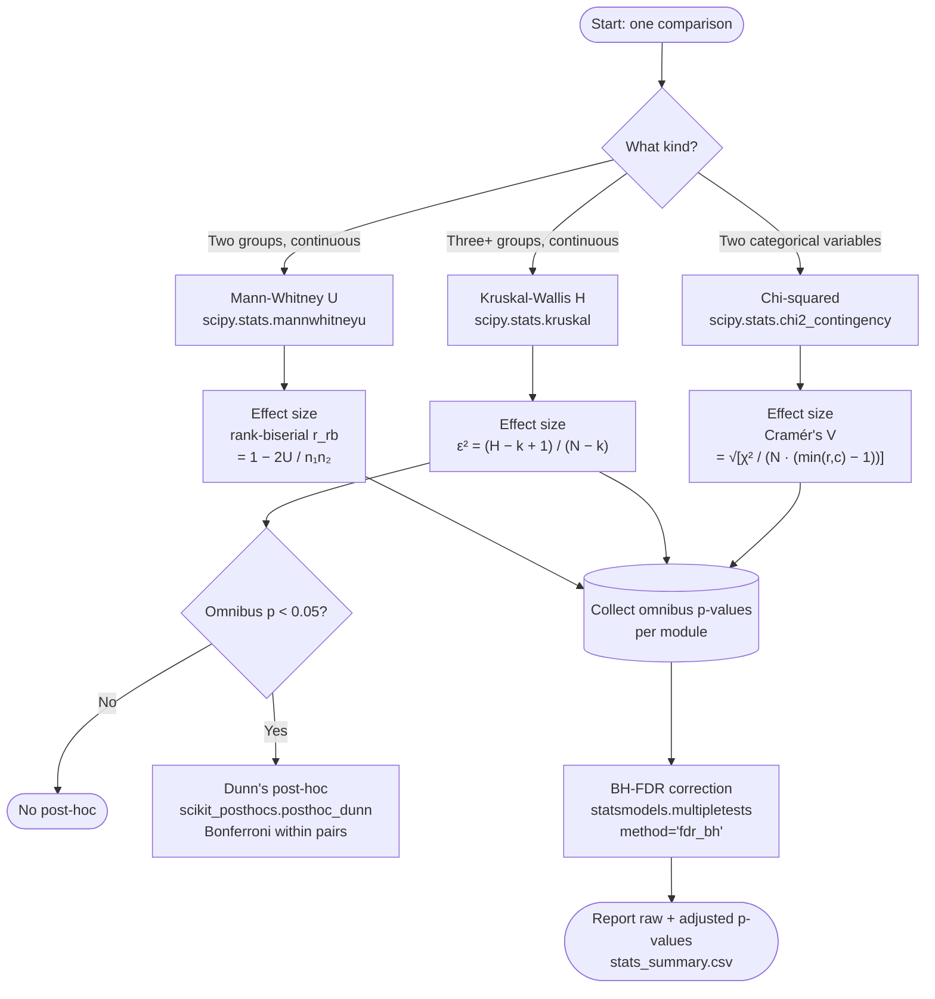

# Statistical Testing Plan for EDA

## Purpose

The EDA currently produces only visualizations (violin plots, histograms, heatmaps).
This document specifies the statistical tests that accompany each visualization,
allowing us to say whether observed differences across demographics and scanners
are statistically significant and how large they are.

---

## Decision Flow



Two correction families are applied independently and must not be conflated:
- **Bonferroni** applies only inside Dunn's post-hoc, controlling the familywise
  error rate across the three pairwise age-bin comparisons.
- **BH-FDR** applies once per module across all omnibus p-values (16 in
  `segmentation_volumes`, 7 in `crosscuts`), controlling the false discovery rate
  at the module level.

---

## Test Battery

Three types of comparison appear in the EDA. Each gets one test and one effect size.

### 1. Two-Group Continuous Comparisons

**Used for:** sex (F vs M), race (White vs Black), manufacturer (GE vs Siemens),
field strength (1.5T vs 3.0T).

| Component | Choice | Rationale |
|---|---|---|
| Test | **Mann-Whitney U** | Volume data is right-skewed; Mann-Whitney makes no normality assumption. With n~1,200 it has excellent power. |
| Effect size | **Rank-biserial correlation (r_rb)** | The nonparametric analogue of Cohen's d. Computed directly from the U statistic: `r_rb = 1 - (2U)/(n1·n2)`. |
| Implementation | `scipy.stats.mannwhitneyu` | Returns U and p. r_rb is derived from U. |

**Interpretation of r_rb:**

| |r_rb| | Magnitude |
|---|---|
| < 0.1 | Negligible |
| 0.1 – 0.3 | Small |
| 0.3 – 0.5 | Medium |
| ≥ 0.5 | Large |

**Why not t-test:** the volume distributions have long right tails (especially
vertebral body volumes in older or male patients). The t-test assumes normality
of the sampling distribution of the mean, which is technically fine at n~600 per
group by CLT, but Mann-Whitney is the standard choice in medical imaging papers
and directly tests whether one group tends to have larger values — which is
exactly the question we care about.

### 2. Three-or-More Group Continuous Comparisons

**Used for:** age bins (<40, 40–60, 60+).

| Component | Choice | Rationale |
|---|---|---|
| Omnibus test | **Kruskal-Wallis H** | Nonparametric extension of one-way ANOVA for 3+ groups. |
| Effect size | **Epsilon-squared (ε²)** | `(H - k + 1) / (N - k)` where H is the test statistic, k is the number of groups, N is total observations. |
| Post-hoc | **Dunn's test with Bonferroni correction** | Pairwise nonparametric comparisons; only run if Kruskal-Wallis is significant (p < 0.05). Bonferroni applied within the post-hoc (`p_adjust='bonferroni'`). |
| Implementation | `scipy.stats.kruskal` + `scikit_posthocs.posthoc_dunn(..., p_adjust='bonferroni')` | Returns a matrix of Bonferroni-adjusted p-values for each pair. |

**Interpretation of ε²:**

| ε² | Magnitude |
|---|---|
| < 0.01 | Negligible |
| 0.01 – 0.06 | Small |
| 0.06 – 0.14 | Medium |
| ≥ 0.14 | Large |

**Why Dunn's over pairwise Mann-Whitney:** The core issue is ranking consistency.
Kruskal-Wallis ranks all observations globally across all groups. Pairwise
Mann-Whitney re-ranks data for each pair using only those two groups' observations
— a different ranking scheme than the omnibus test used. This makes the two analyses
analytically inconsistent. Dunn's test uses the same global rankings and pooled
variance estimate as Kruskal-Wallis, maintaining full consistency with the omnibus
result. It is the standard recommendation in the biostatistics literature (Dunn, 1964)
and what is used in Parikh et al. (MAMA-MIA) for post-hoc pairwise comparisons.

**Why Bonferroni (not BH-FDR) inside Dunn's:** Bonferroni controls the familywise
error rate within the post-hoc comparisons (3 pairs for age bins). BH-FDR is applied
separately at the module level across all omnibus p-values. These are two distinct
correction families and should not be conflated.

### 3. Categorical Independence (Crosstabs)

**Used for:** race × manufacturer, race × field strength, sex × race.

| Component | Choice | Rationale |
|---|---|---|
| Test | **Chi-squared test of independence** | Standard for testing independence between two categorical variables. Expected cell counts are all well above 5 given n~1,200. |
| Effect size | **Cramér's V** | `sqrt(χ² / (N · (min(r, c) - 1)))` where r and c are the dimensions of the contingency table. |
| Implementation | `scipy.stats.chi2_contingency` | Returns χ², p, dof, and expected frequencies. V is derived from χ². |

**Interpretation of Cramér's V:**

| V | Magnitude |
|---|---|
| < 0.1 | Negligible |
| 0.1 – 0.3 | Small |
| 0.3 – 0.5 | Medium |
| ≥ 0.5 | Large |

**What this confirms:** A non-significant chi-squared (p > 0.05) with a small V
(< 0.1) formally establishes that two categorical variables are independent —
e.g., that scanner manufacturer does not confound race, which is currently only
claimed based on visual inspection of heatmaps.

---

## Additional Techniques Considered

### Bootstrap Confidence Intervals

BCa (bias-corrected and accelerated) bootstrap 95% CIs for median differences
between groups.

- `scipy.stats.bootstrap((group_a, group_b), statistic=median_diff, method='BCa', n_resamples=10000)`
- Reports a 95% CI for the median difference alongside the point estimate.

**When this is useful:** When p-values alone do not convey the practical magnitude
of a difference. A CI on the median difference tells you "males have 10,000–15,000
mm³ more vertebral body volume" which is more informative than "p < 0.001". Most
useful for the primary findings (sex effect on volume) where practical magnitude
matters. Less useful for the confounder checks (race × scanner) where a simple
"significant or not" answer suffices.

**Verdict:** Worth implementing for the main demographic volume comparisons (sex,
race) where we want to report the size of the anatomical difference in mm³.
Not needed for the categorical independence tests.

### Multiple Testing Correction (Benjamini-Hochberg FDR)

When running many statistical tests, some will be significant by chance.
Benjamini-Hochberg FDR controls the expected proportion of false discoveries.

- `statsmodels.stats.multitest.multipletests(p_values, method='fdr_bh')`
- Reports both raw and FDR-adjusted p-values.

**When this is useful:** When running dozens or hundreds of tests (e.g., gene
expression studies). With ~12–18 tests total in our EDA, the multiple testing
burden is modest. However, it is a one-line addition and costs nothing, so there
is no reason not to include it.

**Verdict:** Include. Collect all p-values from a single EDA module run, apply
BH-FDR, report both raw and adjusted p-values. Define one "family" per analysis
module (e.g., all segmentation volume tests together, all crosscut tests together).

### Fairness-Specific Metrics (DIR, Fairness Gap)

From the Biased Ruler and MAMA-MIA literature:

- **Disparate Impact Ratio (DIR):** `mean_worst_group / mean_best_group`. DIR < 0.8
  is considered a legally concerning disparity in the fairness literature.
- **Fairness gap:** `|mean_best - mean_worst|`, the absolute difference between the
  best and worst performing groups.

**When this is useful:** These are designed for evaluating model *performance*
across subgroups (e.g., Dice scores). Applying them to anatomical volumes in the
EDA phase is technically possible but semantically odd — we are not measuring
"fairness" of anatomy, we are characterizing confounders.

**Verdict:** Do not implement in the EDA. Implement in Phase 4 when analyzing
Dice scores across subgroups, where DIR and fairness gap are the standard metrics.

### Permutation Tests

Shuffle demographic labels 10,000 times, compute the test statistic each time,
derive an empirical p-value. Completely distribution-free.

**When this is useful:** When distributional assumptions are uncertain and the
sample size is small enough that asymptotic approximations may not hold. With
n~1,200, the asymptotic p-values from Mann-Whitney and Kruskal-Wallis are
reliable. Permutation tests would give essentially identical results.

**Verdict:** Not needed for the EDA. Can be useful in Phase 4 for the Dice score
analysis where scores are bounded [0, 1] and potentially heavily left-skewed,
making the asymptotic approximation less certain.

### Normality Pre-Tests (Shapiro-Wilk)

Running a normality test to decide between t-test and Mann-Whitney.

**Why this is bad practice:** The decision of which test to use should be based on
domain knowledge (we know the data is skewed from the histograms), not on a
preliminary statistical test. Normality pre-testing inflates the overall Type I
error rate and is [widely discouraged](https://doi.org/10.1111/j.1365-2753.2006.00629.x)
in the biostatistics literature. We use Mann-Whitney because our data is skewed,
not because a Shapiro-Wilk test told us so.

**Verdict:** Do not implement. Use Mann-Whitney unconditionally.

---

## Where Each Test Is Applied

### Module coverage overview

| Module | Has group comparisons? | Tests added? | Notes |
|---|---|---|---|
| `demographics.py` | No | N/A | Univariate distributions only |
| `scanner.py` | No | N/A | Univariate distributions only |
| `crosscuts.py` | Yes | Yes | 4 violin plots + 3 heatmaps |
| `mri_volumes.py` | No | N/A | Univariate histograms only; no demographic splits exist in the current code |
| `mri_slices.py` | No | N/A | Image rendering only |
| `segmentation_volumes.py` | Yes | Yes | 16 tests |
| `splits.py` | Separate concern | Deferred | Split balance checks are a distinct analysis; not part of the EDA fairness audit |

### `src/eda/segmentation_volumes.py`

The existing code produces violin plots for volumes, voxel counts, and component
counts split by sex, race, and age. Each violin plot gets a corresponding test:

| Existing plot | Grouping variable | Test type |
|---|---|---|
| `vol_by_sex_*` | Sex (2 groups) | Mann-Whitney U |
| `vol_by_race_*` | Race (2 groups: White vs Black) | Mann-Whitney U |
| `vol_by_age_*` | Age bin (3 groups) | Kruskal-Wallis + Dunn's |
| `comp_by_sex_*` | Sex (2 groups) | Mann-Whitney U |
| `comp_by_race_*` | Race (2 groups) | Mann-Whitney U |
| `comp_by_age_*` | Age bin (3 groups) | Kruskal-Wallis + Dunn's |
| `voxels_by_manufacturer_*` | Manufacturer (2 groups) | Mann-Whitney U |
| `vol_mm3_by_manufacturer_*` | Manufacturer (2 groups) | Mann-Whitney U |

Each test result (p-value, effect size, group medians, group sizes) is logged
via `report.log_stat()` and collected into a summary table saved as CSV.

**Measures tested** (for each grouping above):

- `volume_mm3_vertebral_body`
- `volume_mm3_disc`
- `n_voxels_vertebral_body` (scanner comparisons only)
- `n_voxels_disc` (scanner comparisons only)
- `n_components_vertebral_body`
- `n_components_disc`

**BH-FDR family:** 12 Mann-Whitney p-values + 4 Kruskal-Wallis p-values = 16 omnibus
p-values. Applied at the end of `run()`.

### `src/eda/crosscuts.py`

The existing code produces both violin plots (continuous age split by categorical
grouping) and heatmaps (categorical × categorical counts). All plots get a test.

**Violin plots — continuous age by grouping variable:**

| Existing plot | Grouping variable | Test type |
|---|---|---|
| `age_by_sex` | Sex (2 groups) | Mann-Whitney U |
| `age_by_race` | Race (White vs Black) | Mann-Whitney U |
| `age_by_manufacturer` | Manufacturer (2 groups) | Mann-Whitney U |
| `age_by_field_strength` | Field strength (2 groups) | Mann-Whitney U |

Note on `age_by_race`: the plot renders all race categories, but several groups
have very small n (AIAN: n=9, NHOPI: n=1). For the statistical test, filter to
White vs Black only — consistent with `segmentation_volumes.py` and sufficient
sample sizes for reliable inference.

**Heatmaps — categorical independence:**

| Existing plot | Contingency table | Test |
|---|---|---|
| `race_by_manufacturer` | Race × Manufacturer | Chi-squared + Cramér's V |
| `race_by_field_strength` | Race × Field Strength | Chi-squared + Cramér's V |
| `sex_by_race` | Sex × Race | Chi-squared + Cramér's V |

**BH-FDR family:** 4 Mann-Whitney p-values + 3 chi-squared p-values = 7 omnibus
p-values. Applied at the end of `run()`.

---

## Code Organization

```
src/eda/
├── stats.py                  <- NEW: utility functions
├── segmentation_volumes.py   <- calls stats functions after each violin plot
├── crosscuts.py              <- calls stats functions after each heatmap
└── report.py                 <- unchanged (log_stat already handles dicts)
```

`stats.py` contains three functions that take raw data in and return a dict out:

- `mann_whitney_result(a, b)` → `{test, U, p, r_rb, median_a, median_b, n_a, n_b}`
- `kruskal_result(groups_dict)` → `{test, H, p, epsilon_sq, posthoc: [{pair, p}, ...], medians, ns}`
- `chi2_result(contingency_df)` → `{test, chi2, p, dof, cramers_v}`

The EDA modules call these functions and pass the returned dicts to
`report.log_stat()`, which already serializes dicts to `stats.json`.

At the end of each EDA module's `run()`, all test results are collected and
BH-FDR correction is applied across the family. Both raw and adjusted p-values
are included in the final summary table.

---

## Dependencies

| Package | Purpose | Already installed? |
|---|---|---|
| `scipy.stats` | Mann-Whitney, Kruskal-Wallis, chi-squared | Yes |
| `scikit-posthocs` | Dunn's post-hoc test | No — needs `uv add scikit-posthocs` |
| `statsmodels` | BH-FDR correction (`multipletests`) | No — needs `uv add statsmodels` |

---

## References

- Mann-Whitney U for non-normal medical data: standard in medical imaging fairness literature (Parikh et al., MAMA-MIA; Zhai et al., CSpineSeg)
- Rank-biserial correlation: Wendt (1972), "Dealing with a common problem in social science: A simplified rank-biserial coefficient of correlation based on the U statistic"
- Kruskal-Wallis + Dunn's: Dunn (1964), "Multiple comparisons using rank sums"
- Chi-squared + Cramér's V: Cramér (1946), *Mathematical Methods of Statistics*
- Against normality pre-testing: Rochon et al. (2012), "To test or not to test: Preliminary assessment of normality when comparing two independent samples"
- Benjamini-Hochberg FDR: Benjamini & Hochberg (1995), "Controlling the false discovery rate: a practical and powerful approach to multiple testing"
- Bootstrap CIs: Efron & Tibshirani (1993), *An Introduction to the Bootstrap*
- Disparate Impact Ratio in medical AI: Parikh et al. (MAMA-MIA)
- Fairness in medical imaging: Xu et al. (2024), "Addressing fairness in deep learning medical image analysis" (*npj Digital Medicine*)
