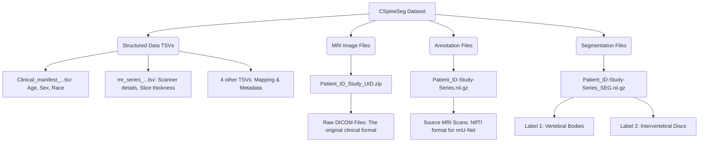

# Data Overview

```mermaid
graph TD
    A[CSpineSeg Dataset] --> B(Structured Data TSVs)
    A --> C(MRI Image Files)
    A --> D(Annotation Files)
    A --> E(Segmentation Files)

    B --> B1[Clinical_manifest_...tsv: Age, Sex, Race]
    B --> B2[mr_series_...tsv: Scanner details, Slice thickness]
    B --> B3[4 other TSVs: Mapping & Metadata]

    C --> C1[Patient_ID_Study_UID.zip]
    C1 --> C2[Raw DICOM Files: The original clinical format]

    D --> D1[Patient_ID-Study-Series.nii.gz]
    D1 --> D2[Source MRI Scans: NIfTI format for nnU-Net]

    E --> E1[Patient_ID-Study-Series_SEG.nii.gz]
    E1 --> E2[Label 1: Vertebral Bodies]
    E1 --> E3[Label 2: Intervertebral Discs]
```
