# Data Overview

The dataset is the **Duke University Cervical Spine MRI Segmentation Dataset (CSpineSeg)**.
It contains 1,255 cervical spine MRI exams from 1,232 patients, with segmentation masks
for vertebral bodies and intervertebral discs.

Data lives on the cluster at `/work3/s225224/data/cspineseg`.

## Directory Structure

```mermaid
flowchart TD
    ROOT["cspineseg/"]

    ROOT --> RAW
    ROOT --> EXT
    ROOT --> PROC["processed/<br><i>empty — for pipeline outputs</i>"]
    ROOT --> SPLIT["splits/<br><i>empty — for train/val/test splits</i>"]

    subgraph RAW["raw/"]
        R1["annotation.zip — 4.9 GB"]
        R2["segmentation.zip — 17 MB"]
        R3["structured.zip — 0.8 MB"]
    end

    subgraph EXT["extracted/"]
        direction LR

        subgraph ANN["annotation/: 1,255#, 4.9GB"]
            ANN1["*.nii.gz<br>MRI volumes in NIfTI format<br>1.7–4.9 MB each"]
        end

        subgraph SEG["segmentation/: 1,255#, 31MB"]
            SEG1["*_SEG.nii.gz<br>Segmentation masks in NIfTI<br>7–245 KB each"]
            SEG1 --- LBL["0 = Background<br>1 = Vertebral Bodies<br>2 = Intervertebral Discs"]
        end

        subgraph STR["structured/ — 6#"]
            T1["case — Demographics"]
            T2["imaging_study — Study info"]
            T3["mr_series — Scanner params"]
            T4["annotation_file — File linkage"]
            T5["image_manifest — DICOM slices"]
            T6["clinical_manifest — Download info"]
        end
    end

    ANN1 -. "1:1 match" .-> SEG1

    style ROOT fill:#2d2d2d,stroke:#888,color:#fff
    style RAW fill:#4a3728,stroke:#a87c5a,color:#fff
    style EXT fill:#28403a,stroke:#5aaa8a,color:#fff
    style ANN fill:#1e3a4a,stroke:#5a9aba,color:#fff
    style SEG fill:#3a1e4a,stroke:#9a5aba,color:#fff
    style STR fill:#1e4a2a,stroke:#5aba6a,color:#fff
    style PROC fill:#3a3a28,stroke:#aaa85a,color:#fff
    style SPLIT fill:#3a3a28,stroke:#aaa85a,color:#fff
    style LBL fill:#2a2a2a,stroke:#666,color:#ccc
```

## Metadata Files (structured/)

| File | Rows | What it contains |
|------|------|-----------------|
| `case_RSNA_20250321.tsv` | 1,232 | One row per patient. Demographics: age, sex, race, ethnicity. |
| `imaging_study_RSNA_20250321.tsv` | 1,255 | One row per MRI exam. Study-level info: body part, study description, age at imaging. |
| `mr_series_RSNA_20250321.tsv` | 1,255 | One row per MRI series. Scanner parameters: manufacturer, field strength, echo time, slice thickness, pixel spacing. |
| `annotation_file_RSNA_20250321.tsv` | 2,510 | One row per file (image + segmentation = 2 per exam). Links files to patient IDs and study/series UIDs. |
| `image_manifest_RSNA_20250321.tsv` | 19,133 | One row per individual DICOM slice. Maps every slice to its patient, study, and series. |
| `clinical_manifest_RSNA_20250321.tsv` | 5 | Download manifest. Lists the other TSV files with checksums and storage URLs. |

## Key Numbers

| Metric | Value |
|--------|-------|
| Total MRI exams | 1,255 |
| Unique patients | 1,232 (23 patients have 2+ exams) |
| Patients with expert annotations (Gold) | 481 (491 exams) |
| Patients with auto-only annotations (Silver) | ~751 (~764 exams) TODO: UPDATED WHEN WE KNOW EXACTLY |
| MRI scanner manufacturers | GE Medical Systems (466), Siemens (789) |
| Field strengths | 1.5T (747 exams), 3.0T (508 exams) |
| Segmentation labels | 0 = background, 1 = vertebral bodies, 2 = intervertebral discs |

## File Naming Convention

**Format:** `{PatientID}_Study-MR-{StudyNumber}_Series-{SeriesNumber}[_SEG].nii.gz`

| Component | Format | Example | Description |
|-----------|--------|---------|-------------|
| `PatientID` | `593973-NNNNNN` | `593973-000123` | Fixed prefix `593973-` + 6-digit zero-padded patient number |
| `StudyNumber` | integer | `456` | MRI exam number (not zero-padded) |
| `SeriesNumber` | integer | `3` | DICOM series number (not zero-padded) |
| `_SEG` suffix | optional | `_SEG` | Present only on segmentation masks, absent on MRI volumes |

- Each MRI volume has exactly one matching `_SEG` file.
- Patients with multiple exams have different `StudyNumber` values (e.g. `Study-MR-1254` and `Study-MR-1255`).

## Gold vs Silver Labels

> **Status: Pending confirmation from dataset authors.**

According to the paper, 481 patients were manually annotated by expert radiologists (Gold Standard),
and the remaining ~751 patients were labeled automatically by an nnU-Net model (Silver Standard).

However, the public MIDRC release marks **all** segmentations as `Retrospective_auto` in the metadata.
There is currently no way to distinguish Gold from Silver in the released files.

We have contacted the authors to request the list of expert-annotated case IDs.
This distinction is critical for our fairness analysis (comparing label quality across demographics).
